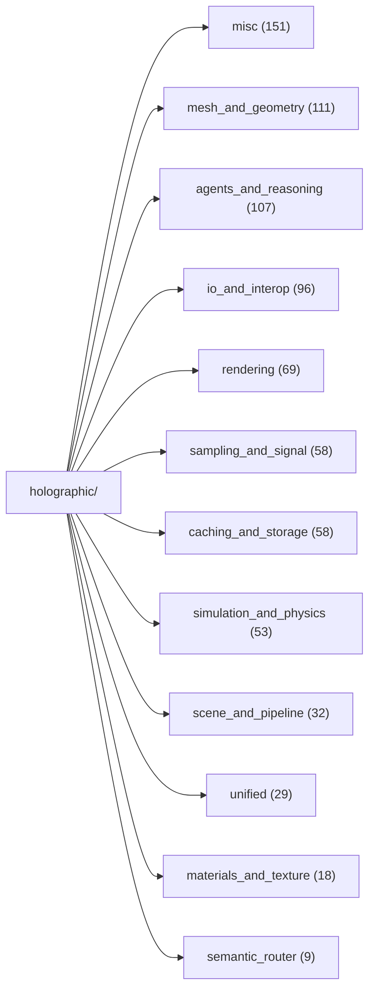
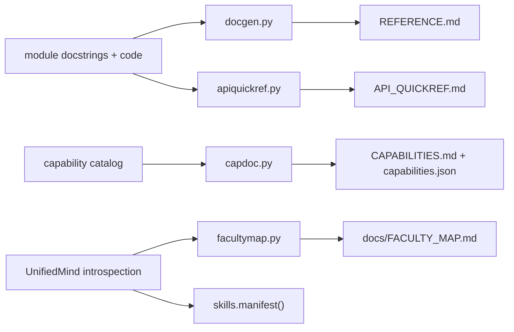

# Documentation map -- which doc answers which question

*Generated by `docmap.py`; regenerate it whenever a doc generator is added. This page exists because the doc generators themselves were once undiscoverable (see the script's docstring).*

| The question you have | Open / run | Generator | Scope |
|---|---|---|---|
| Read the WHOLE engine, module by module | `REFERENCE.md` | `docgen.py` | every holographic_* module: its why-docstring, public classes and functions |
| I have a JOB to do -- which capability, and what do I type? | `CAPABILITIES.md` | `capdoc.py` | the curated capability catalog, grouped, with runnable examples (machine twin: capabilities.json) |
| What can the APP-BUILDING surface do (scene, mesh, camera, render)? | `API_QUICKREF.md` | `apiquickref.py` | one line per public symbol of a short curated module list |
| What can the MIND do, by topic (mesh_*, render_*, file_* ...)? | `docs/FACULTY_MAP.md` | `facultymap.py` | all UnifiedMind public methods, prefix-clustered, one-line docs (live introspection) |
| How do I get from an X to a Y? (which tool-output feeds which tool-input) | `docs/PIPELINE_MAP.md` | `pipelinemap.py` | the workflow graph derived from the catalog's consumes/produces tags (machine twin: pipelines.json) |
| Does the HTTP service's doc still match its routes and CLI flags? | `SERVICE.md` | `servicedoc.py` | a CHECKER, not a generator: gates the endpoint table + launch flags against the live code (`--print` emits a fresh table to paste). ci.yml runs it; it is deliberately NOT in tools/regen_docs.py, which only owns files that are REGENERATED wholesale |
| Machine-readable cards for agents (act/choose routing, autocomplete) | `(in-memory)` | `holographic_skills.manifest()` | capability + method cards as data; not a file on disk |
| Is the tree still ORGANIZED (misc budget, giants, section markers)? | `(report)` | `tools/structure_audit.py` | budgeted-baseline structural gates; fails only on regression |
| How will the void explorer let us leap beyond known data, honestly? | `docs/VOID_EXPLORER_PLAN.md` | `hand-written` | the metaball model (expand radii, collide, mix at the lens), the propose-validate-research-record pipeline built from existing organs, provenance rungs for conjectures, composability in plans/apps/hosted, and the honest limits |
| I am building an app ON leCore -- where do I start? | `docs/BUILDING_ON_LECORE.md` | `hand-written` | the App substrate: per-app per-user memory with physical isolation, remember/recall with provenance, observe/suggest/habits so the app grows with the person using it, a capability preflight, and the honest limits |
| What IS lever 7, and why should I trust it? | `docs/LEVER7.md` | `hand-written` | the displacement trace: the superposed algebra, the delta-rule write, the governance table (calibration, veto, sessions, receipts, provenance), where it sits against Titans / Larimar / MemoryLLM, and the kept negatives that shaped it |
| How do I install leCore INTO a model with Unicron? | `docs/UNICRON_INSTALL.md` | `hand-written` | the runbook for tools/unicron_install.py: facts into down_proj, the algebra as circulants, a routed swarm that arrives off, the five-point health gate, budget-by-bisect, cartridges with exact revert, and the honest boundary |

Regenerate the generated set in one go (the close-out ritual):

```sh
python3 tools/regen_docs.py           # every generator (canonical list)
python3 tools/regen_docs.py --check   # or: is anything stale? (what the CI drift-gate asks)
```

The generators it runs, read from that list at generation time so this page cannot drift:

- `docgen.py` -> `REFERENCE.md`
- `capdoc.py` -> `CAPABILITIES.md`, `capabilities.json`
- `apiquickref.py` -> `API_QUICKREF.md`
- `facultymap.py` -> `docs/FACULTY_MAP.md`
- `docmap.py` -> `docs/DOC_MAP.md`
- `holographic/caching_and_storage/holographic_pipelinemap.py` -> `docs/PIPELINE_MAP.md`, `pipelines.json`
- `tools/unifiers.py --write` -> `docs/UNIFIERS.md`

## Family layout (791 modules)



## Doc pipeline


